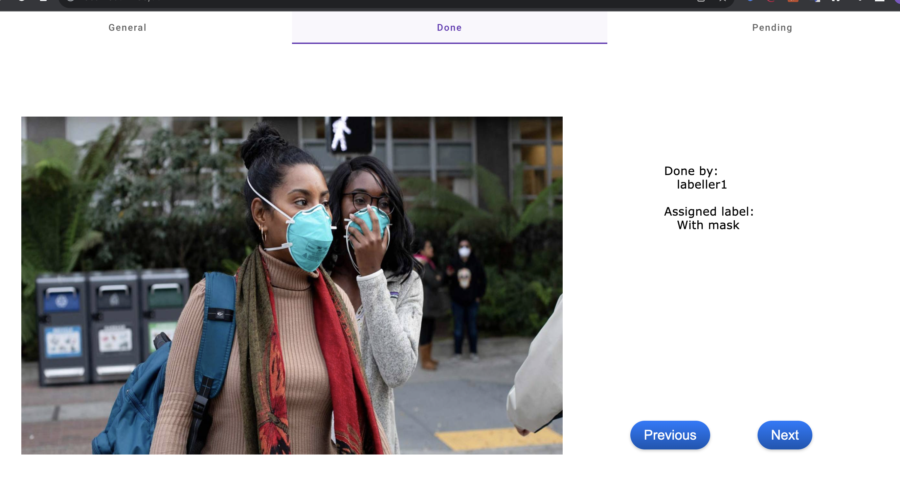
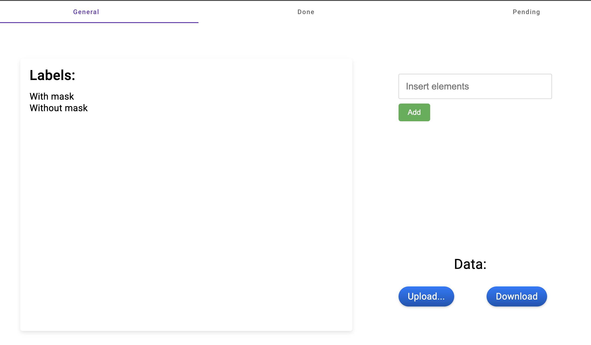
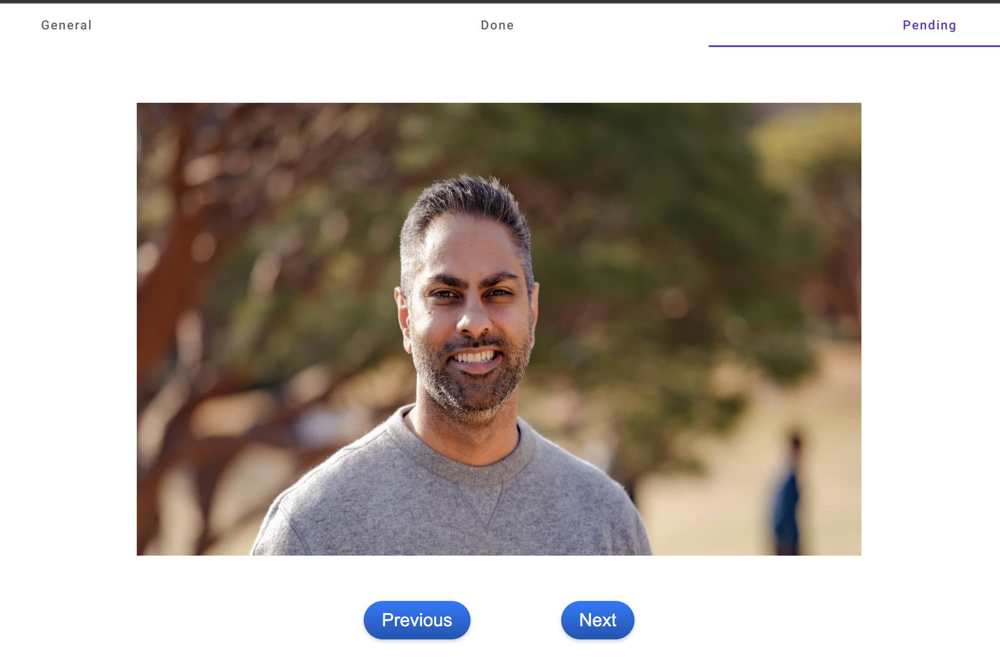
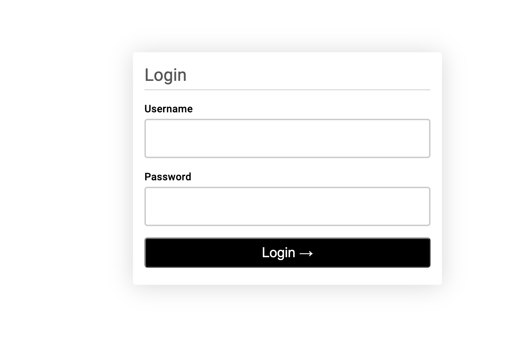

# ML Project Guide

## How to execute

1. Clone repository
2. Install requirements
3. Set database URL in the .env.
4. Make sure your PostgreSQL database is running.
5. From backend directory execute 'make serve'
6. From frontend directory execute 'ng serve'

The current backend creates 3 users (an admin and two labellers) and the two labels (with mask, without mask) when initialized. To test the well functioning of the app:

1. Navigate to localhost:4200 on the browser
2. Login with admin (username:admin, password:1234)
3. On the general tab, click on Upload... and add images (restricted to one at a time). (Images can be found in the asset folder of frontend)
4. Go back to login page and log in with labeller1 (username:labeller1, password:1234)
5. Set the label for some images
6. Go back to login page and log in with labeller2 (username:labeller2, password:1234)
7. Set the label for some images
8. Now log in with admin again and check the information displayed in the done and pending tabs.
9. Finally, for testing the label box, comment the lines that create the labels in the database on init (main function of routes.py) and execute the app again.

### Testing

1. Make sure the DATABASE_URL is set in .env
2. Adjust the testing functions (in tests/unit/test_routes.py) according to the current data on the database for assertion.
3. From the backend directory run "make test" from the terminal (results of pytest will appear in terminal).
4. From the frontend directory run "ng test" from the terminal (a pop-up window will appear with the test results).

## Frontend Component Structure

- Login 
- Labeller
- Admin
  - Tabs
  - General
  - Done
  - Pending

## Backend Structure

- app
  - models (database models)
  - routes (Flask routes)
- tests
  - unit (unit tests)
- .env (environment variables)
- api.yaml (for testing api)
- makefile
- requirements.txt

## Considerations

These are some features that I thought on adding or testing while coding.

* Try to save labels in frontend (bad for large set of labels).
* Import multiple images at once.
* Prohibit access to the admin or labeller pages without logging in (currently its possible to access these pages with the URL).
* Implement api endpoints to delete table elements.
* I could have included the format of the images (jpg, png, etc) in the images table.
* There is a bug in the upload button, it appears as an error in the console, but the images are processed correctly.
* A possible alternative for endpoints would be to use more of the GET type instead of POST endpoints with arguments.
* It is a good practice to create a class for services (eg html in frontend) and import from there.
* Some functions from pending and done are very similar, they could be inherited from admin.
* The labeller cannot correct label from images that he has labelled in other sessions (past logins).
* Using asyncio and aiohttp.

## Images

